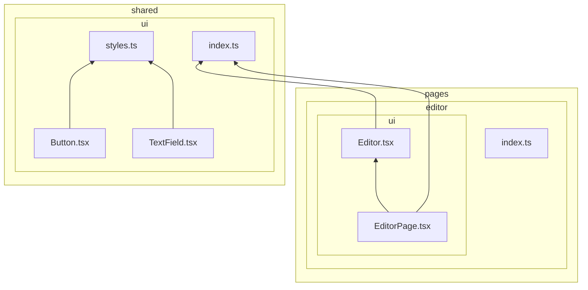
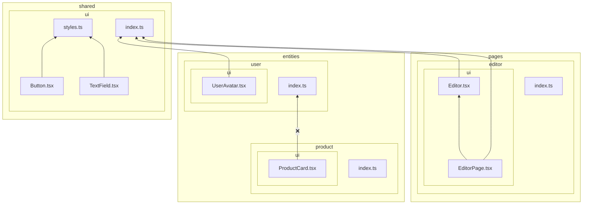
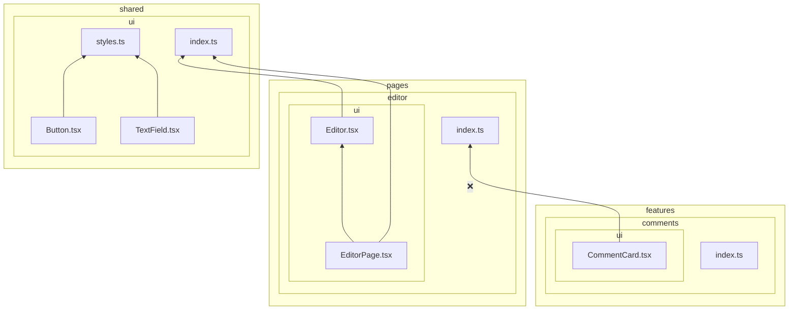

# `forbidden-imports`

This rule forbids imports from higher layers and cross-imports between slices on the same layer. This is in accordance to the import rule on layers:

> A module in a slice can only import other slices when they are located on layers strictly below.
> 
> https://feature-sliced.design/docs/reference/layers#import-rule-on-layers

Example of a project structure that passes this rule:

Examples of project structures that fail this rule:

## Rationale

This is one of the main rules of Feature-Sliced Design, it ensures low coupling and predictability in refactoring.
