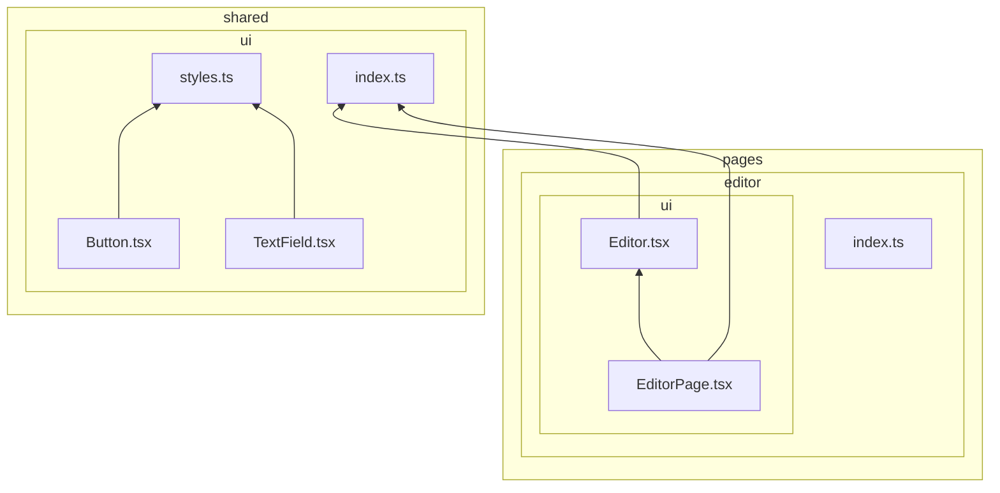
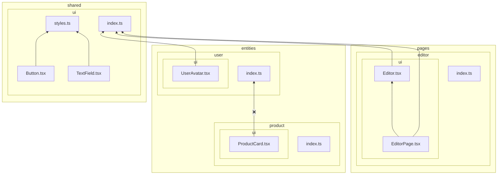
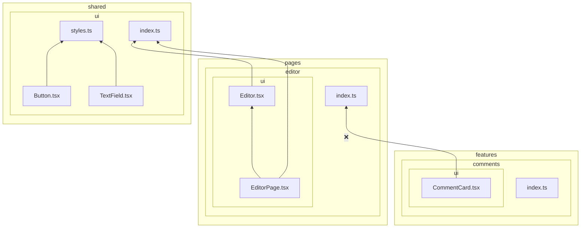

# `forbidden-imports`

This rule forbids imports from higher layers and cross-imports between slices on the same layer. This is in accordance to the import rule on layers:

> A module in a slice can only import other slices when they are located on layers strictly below.
>
> https://feature-sliced.design/docs/reference/layers#import-rule-on-layers

Example of a project structure that passes this rule (arrows signify imports):



```mermaid
flowchart BT
  subgraph shared
    subgraph shared/ui[ui]
      shared/ui/styles.ts[styles.ts]
      shared/ui/Button.tsx[Button.tsx]
      shared/ui/TextField.tsx[TextField.tsx]
      shared/ui/index.ts[index.ts]
    end
  end

  subgraph entities
    subgraph entities/user[user]
      subgraph entities/user/at-x[@x]
        entities/user/at-x/product.ts[product.ts]
      end
      subgraph entities/user/ui[ui]
        entities/user/ui/UserAvatar.tsx[UserAvatar.tsx]
      end
      entities/user/index.ts[index.ts]
    end
    subgraph entities/product[product]
      subgraph entities/product/ui[ui]
        entities/product/ui/ProductCard.tsx[ProductCard.tsx]
      end
      entities/product/index.ts[index.ts]
    end
  end

  subgraph pages
    subgraph pages/editor[editor]
      subgraph pages/editor/ui[ui]
        pages/editor/ui/EditorPage.tsx[EditorPage.tsx]
        pages/editor/ui/Editor.tsx[Editor.tsx]
      end
      pages/editor/index.ts[index.ts]
    end
  end

  shared/ui/Button.tsx --> shared/ui/styles.ts
  shared/ui/TextField.tsx --> shared/ui/styles.ts
  entities/user/ui/UserAvatar.tsx --> shared/ui/index.ts
  entities/product/ui/ProductCard.tsx --> entities/user/at-x/product.ts
  pages/editor/ui/Editor.tsx --> shared/ui/index.ts
  pages/editor/ui/EditorPage.tsx --> shared/ui/index.ts
  pages/editor/ui/EditorPage.tsx --> pages/editor/ui/Editor.tsx
```

Examples of project structures that fail this rule:





## Rationale

This is one of the main rules of Feature-Sliced Design, it ensures low coupling and predictability in refactoring.

## Related Rules

If you need more granular control, this rule's functionality is split into two separate rules that you can use independently:

- `no-higher-level-imports`: Only checks for imports from higher layers (e.g., features importing from pages)
- `no-cross-imports`: Only checks for cross-imports between slices on the same layer (e.g., one entity importing from another entity)

Using these separate rules allows you to enforce only specific aspects of the import restrictions or configure them differently.
