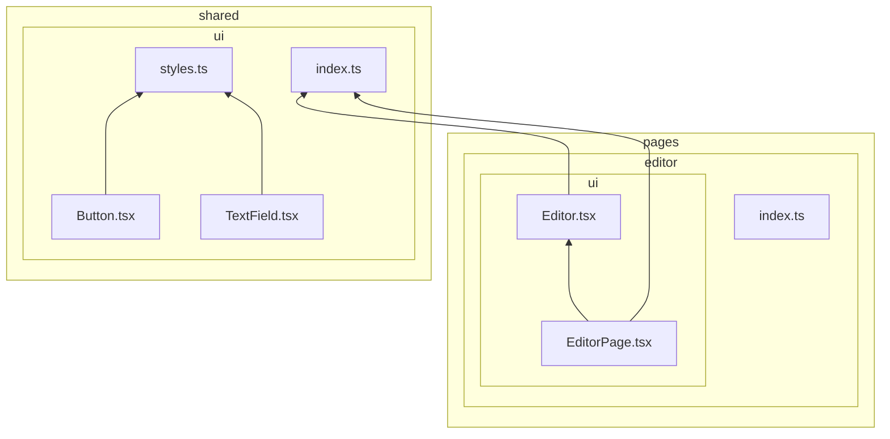
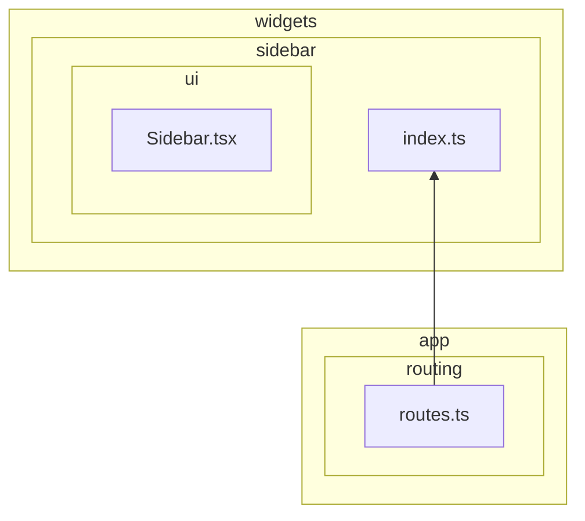
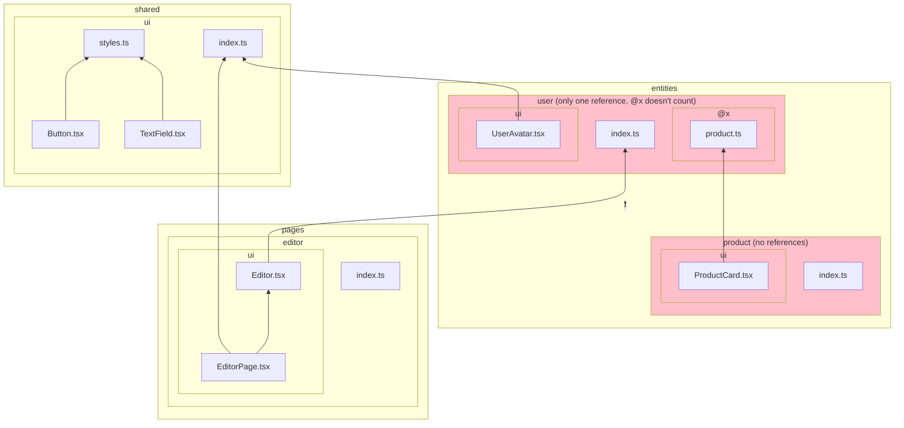

# `insignificant-slice`

It detects slices that have no references to suggest removing them, and also slices that have just one reference, to suggest merging it into the layer above.

Note that pages are allowed to only have one reference, as they are the almost like entry points to the application. Another exception is when slices are only used on the App layer — this doesn't count as a violation of the rule because the App layer shouldn't contain UI, so there's a valid reason for the code to remain on the lower layers.

Example of a project structure that passes this rule (arrows signify imports):

Example of a project structure that fails this rule:

## Rationale

Trying to decompose everything into as many layers and slices as possible leads to the logic spreading out needlessly, which negates the high cohesion benefit of Feature-Sliced Design. That's why if a slice is only used once, it's probably not worth having it as a separate slice.
