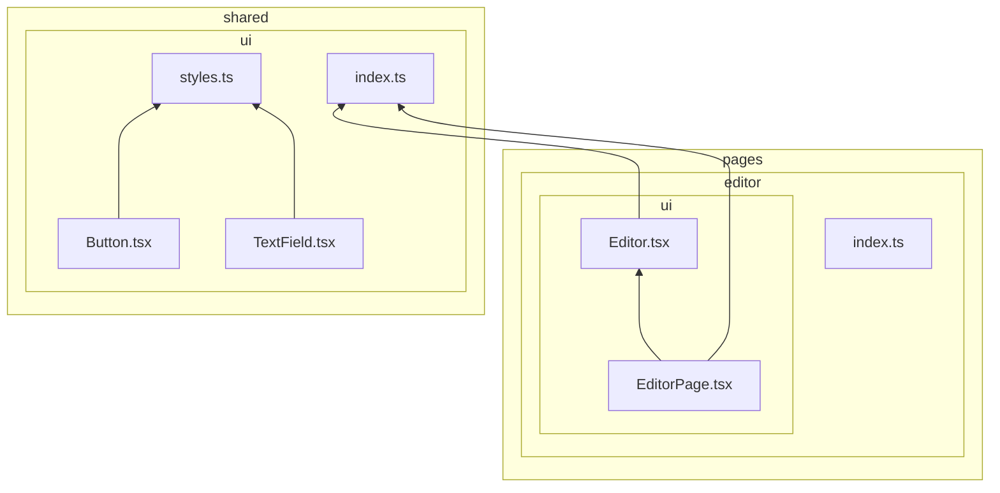
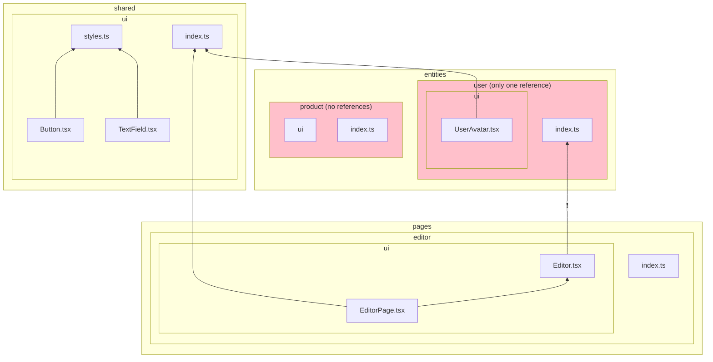

# `insignificant-slice`

It detects slices that have no references to suggest removing them, and also slices that have just one reference, to suggest merging it into the layer above. Note that pages are allowed to only have one reference, as they are the almost like entry points to the application.

Example of a project structure that passes this rule (arrows signify imports):

Example of a project structure that fails this rule:

