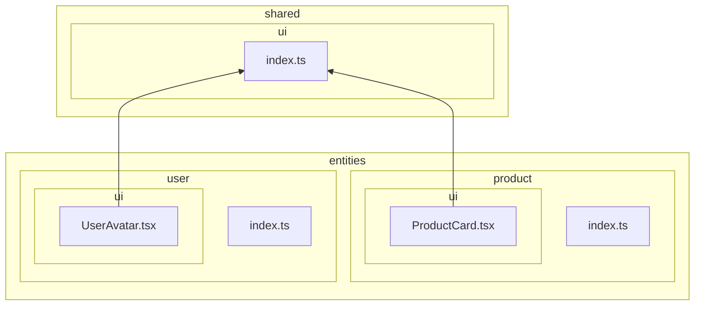
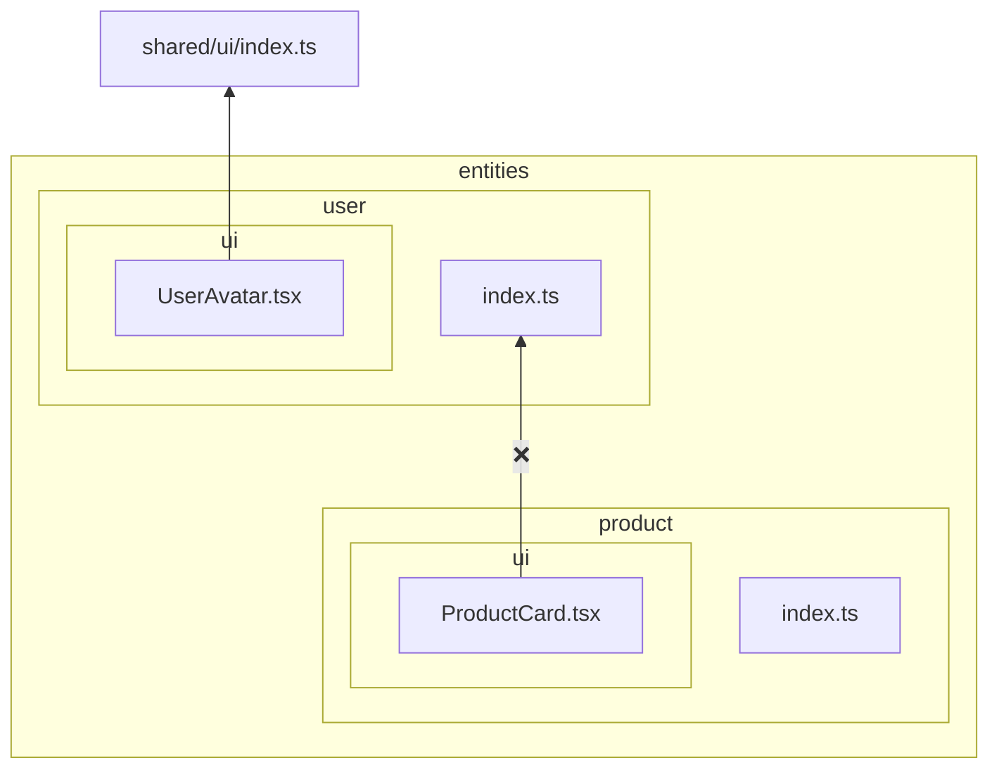
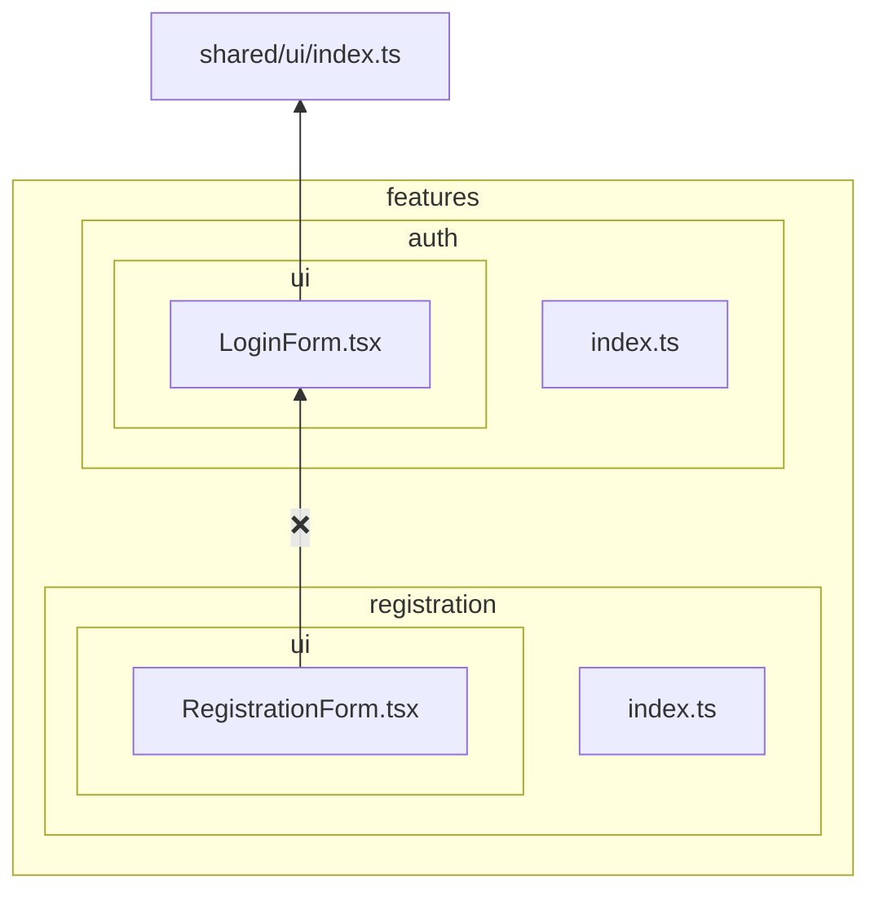

# `no-cross-imports`

This rule forbids cross-imports between slices on the same layer. This is in accordance to the slice isolation principle in Feature-Sliced Design:

> A module in a slice can only import other slices when they are located on layers strictly below.
>
> https://feature-sliced.design/docs/reference/layers#import-rule-on-layers

Example of a project structure that passes this rule (arrows signify imports):



```mermaid
flowchart BT
  subgraph entities
    subgraph entities/user[user]
      subgraph entities/user/@x[@x]
        entities/user/@x/product.ts[product.ts]
      end
      subgraph entities/user/ui[ui]
        entities/user/ui/UserAvatar.tsx[UserAvatar.tsx]
      end
      entities/user/index.ts[index.ts]
    end
    subgraph entities/product[product]
      subgraph entities/product/ui[ui]
        entities/product/ui/ProductCard.tsx[ProductCard.tsx]
      end
      entities/product/index.ts[index.ts]
    end
  end

  entities/user/ui/UserAvatar.tsx --> shared/ui/index.ts
  entities/product/ui/ProductCard.tsx --> entities/user/@x/product.ts
```

Examples of project structures that fail this rule:





## Rationale

This is one of the main rules of Feature-Sliced Design, it ensures low coupling and predictability in refactoring.
